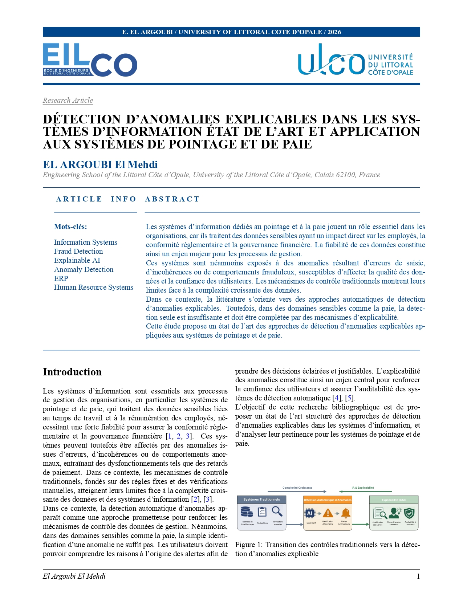
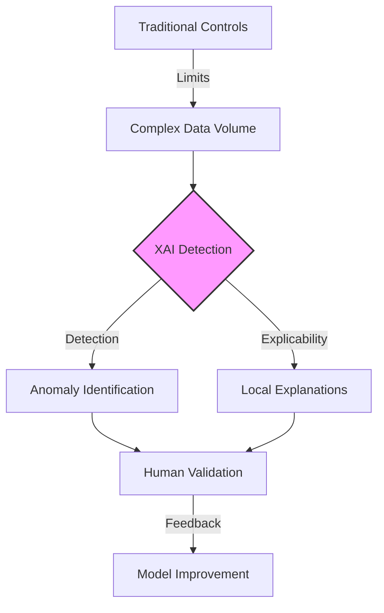

# 🔍 Explainable Anomaly Detection in ERP & Payroll Systems

[-green.svg)](#)

---

## 📄 Article Preview

  
   
  <i>Conceptual mockup of the research article.</i>

> **Original Title:** *DÉTECTION D’ANOMALIES EXPLICABLES DANS LES SYS- TÈMES D’INFORMATION : ÉTAT DE L’ART ET APPLICATION AUX SYSTÈMES DE POINTAGE ET DE PAIE*

---

## 📖 Table of Contents
- [Abstract](#-abstract)
- [Key Themes](#-key-themes)
- [Anomalies Typology](#-anomalies-typology)
- [Detection Approaches Comparison](#-detection-approaches-comparison)
- [Methodology Flow](#-methodology-flow)
- [Explainability (XAI)](#-explainability-xai)
- [Future Perspectives](#-future-perspectives)
- [References](#-references)
- [Download](#-download)

---

## 📝 Abstract
This bibliographic study explores the integration of **Explainable Artificial Intelligence (XAI)** in ERP and payroll information systems. As organizations face increasingly complex data, traditional rule-based controls are no longer sufficient. This research reviews the state-of-the-art in anomaly detection, emphasizing the need for **auditability** and **transparency** in sensitive domains like human resources and financial governance.

---

## 🎯 Key Themes
- 🛡️ **Fraud Prevention**: Identifying intentional violations in payroll data.
- ⚙️ **ERP Reliability**: Ensuring data integrity across interconnected management modules.
- 💡 **Interpretability**: Moving from "Black Box" models to "Open Box" explanations using **LIME** and **SHAP**.

---

## 📊 Anomalies Typology
The study classifies anomalies encountered in management systems into three distinct categories:

| Type | Description | Example in Payroll |
| :--- | :--- | :--- |
| **Statistical** | Numeric outliers deviating from historical norms. | Unusual spike in monthly overtime pay. |
| **Behavioral** | Atypical patterns of actions or entity profiles. | Recurrent overtime requests for specific periods. |
| **Logical** | Violations of explicit business rules or constraints. | Conflict between hours worked and contract limits. |

---

## 🚀 Detection Approaches Comparison

| Feature | Rule-Based | Statistical | Advanced ERP |
| :--- | :---: | :---: | :---: |
| **Automation** | Low | Medium | High |
| **Adaptability** | Low | Medium | High |
| **Auditability** | High | Medium | High (if explainable) |
| **Interpretability** | Very High | Medium | Variable |

---

## 🗺️ Methodology Flow
The following diagram illustrates the transition from traditional controls to explainable detection systems:

---

## 🧠 Explainability (XAI)
To ensure every alert is an **actionable insight**, the study highlights:
- **LIME**: Local interpretable model-agnostic explanations.
- **SHAP**: Shapley Additive Explanations for consistent feature importance.
- **Intrinsic Models**: Hybrid systems combining symbolic logic with machine learning.

> "In sensitive domains like payroll, identifying an anomaly is only half the battle; explaining *why* it was flagged is critical for legal protection and user trust."

---

## 🔮 Future Perspectives
- ⏳ **Temporal Data**: Better handling of time-series constraints in XAI.
- 🤝 **Human-in-the-Loop**: Seamless integration of human expertise for model refinement.
- ⚖️ **Regulatory Compliance**: Aligning detection frameworks with evolving GDPR and labor laws.

---

## 📚 References
Exhaustive list of scientific papers cited in this study:

1. **Wang, N., Zhang, X., Li, S., & Gao, X. (2025)**. Applications of artificial intelligence in enterprise human resource management. *Information Resources Management Journal*.
2. **Saha, S., & Goel, P. (2023)**. Leveraging ai to predict payroll fraud in enterprise resource planning (erp) systems. *International Journal of Information Management*.
3. **Ravichandran, S., Krishnan, R., & Balaji, M**. Ai-powered payroll fraud detection: Enhancing financial security in hr systems. *Journal of Financial Crime*.
4. **Islam, S. R., Eberle, W., Ghafoor, S. K., & Ahmed, M. (2021)**. Explainable artificial intelligence approaches: A survey. *IEEE Access*.
5. **Schmid, S., Assent, I., & Müller, E. (2023)**. Anomaly explanation: A survey. *ACM Computing Surveys*.
6. **Li, Z., Zhu, J., & van Leeuwen, M. (2023)**. A survey on explainable anomaly detection. *ACM Transactions on Knowledge Discovery from Data*.
7. **Jamithireddy, N. H. (2023)**. Driven anomaly detection and root cause analysis in sap erp using hybrid neural-symbolic systems. *Procedia Computer Science*.
8. **Milojković, N., Kljajić, M., & Dakić, B. (2025)**. Z-score and validoai: An explainable ai framework for payroll analytics with statistical anomaly detection in smes. *Expert Systems with Applications*.
9. **Kwon, Y., Moon, D., Oh, Y., & Yoon, H. (2025)**. Logicqa: Logical anomaly detection with vision-language model generated questions. *Pattern Recognition*.
10. **Kumar, N., Sharma, V., & Sharma, A. (2025)**. Artificial intelligence in fraud prevention: Techniques, applications, challenges and opportunities. *Journal of Big Data*.
11. **Tritscher, J., Keller, F., & Müller, E. (2023)**. Feature relevance xai in anomaly detection: Reviewing approaches and challenges. *Data Mining and Knowledge Discovery*.
12. **Mohammad, A. J. (2021)**. Ai-augmented time theft detection system. *International Journal of Advanced Computer Science and Applications*.
13. **Yepmo, V., Ndiaye, L., & Dipanda, A. (2022)**. Anomaly explanation: A review. *Artificial Intelligence Review*.
14. **Botana, I. L., Pau, R., & Domingo-Ferrer, J. (2022)**. Explanation method for anomaly detection on mixed numerical and categorical spaces. *Information Sciences*.
15. **Gummadi, A. N., Kumar, P., & Patra, S. R. (2024)**. Xai-iot: An explainable ai framework for enhancing anomaly detection in iot systems. *Future Generation Computer Science*.
16. **Bello, O. A., & Olufemi, K. (2024)**. Artificial intelligence in fraud prevention: Applications, challenges and future directions. *Journal of Information Security and Applications*.

---

## 📥 Download
> [!TIP]
> **[Download the Full Article (PDF)](Explainable_Anomaly_Detection_ERP.pdf)**

---

  <b>© 2026 E. EL ARGOUBI - University of Littoral Côte d’Opale</b> 
  <i>Engineering School of the Littoral Côte d’Opale (EILCO)</i>

